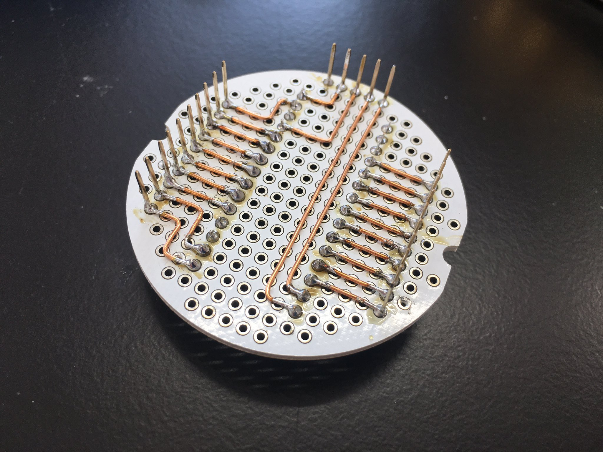

# ふつくしい配線は良いというおはなし

Date:2022/06/19

今日はとある事情で研究所に行って色々やってました  
その時に息抜きに作った回路が割と好評だったので、Twitterにも上げたものですがここにも残します

まずはｵｼｬｼﾝをば

  

  

どうです？　めちゃくちゃ良くないですか？　（自画自賛）

一枚目はArduino Nanoを載せる基板、二枚目は立体配線で作った非安定マルチバイブレータです  
直線・直角配線こそ至高。これは何度でも唱えていきたい

二枚目のバイブレータの動作、ちゃんと動いてくれてますね

<blockquote class="twitter-tweet">
新幹線の中で発振回路を発振させてます（非安定マルチバイブレータ） <a href="https://t.co/HD19oLQPBm">pic.twitter.com/HD19oLQPBm</a>
&mdash; 溶けかけてるうさぎ (@_meltingrabbit) <a href="https://twitter.com/_meltingrabbit/status/1538494111967170561?ref_src=twsrc%5Etfw">June 19, 2022</a></blockquote> 

回路定数ですが、コンデンサの＋側とLEDに繋がっている抵抗が4.7kΩ、コンデンサのー側に繋がっている抵抗が82kΩ、コンデンサ容量が10μF、トランジスタは2SC1815、電源電圧は9Vです（006P）  
この通りに作ると遮断器の信号みたいな光り方をします

