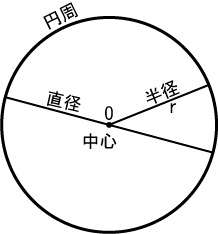

<script type="text/x-mathjax-config">MathJax.Hub.Config({tex2jax:{inlineMath:[['\$','\$'],['\\(','\\)']],processEscapes:true},CommonHTML: {matchFontHeight:false}});</script>
<script type="text/javascript" async src="https://cdnjs.cloudflare.com/ajax/libs/mathjax/2.7.1/MathJax.js?config=TeX-MML-AM_CHTML"></script>

# πという邪悪な存在

<h2><div align="right">2022/07/10</div></h2>

<!-- 記事ここから -->

円周率$ \pi $、数学や物理を学んでいると嫌というほど出てきますよね

普通であれば「あ、また出てきた」くらいのものだと思いますが、ちょっと考えてみたらこの「$ \pi $」って結構邪悪な存在なんですよね。僕が思うには

なので、なぜ「邪悪な存在」なのかを僕なりに書き残そうとおもいます

## 理由①｜定義の問題

$ \pi $の定義は、「円周/直径」。これは皆さんご存知だと思います

<div align="center">$ \pi = \cfrac{l}{R} \fallingdotseq 3.1416 $</div>

では、円の定義はというと、「平面上で、定点からの距離が同じ点の集まり」です  
ここで、定点からの距離というのは半径です。つまり、円は半径によって定義されています

<div align="center">パブリック・ドメイン, <a href="https://commons.wikimedia.org/w/index.php?curid=102465847">リンク</a></div>

ならば、円周率も半径で定義すべきじゃないの？　と思いませんか？

ちなみにこの場合、$ \pi $の代わりに$ \tau $を使うことが多いそうです。名前も同じ円周率だとごちゃごちゃになるので、「円周比」という呼び方を提案したい

<div align="center">$ \tau = \cfrac{l}{r} \fallingdotseq 6.2832 $</div>

また、$ \pi $と$ \tau $の関係性は以下の通り

<div align="center">$ \tau = 2 \pi $</div>

定義の中で分母が半分になっているので、まあ当然

## 理由②｜実用上の問題

突然ですが、以下の3つの不定積分の式を見て下さい（積分定数は省略しています）

<div align="center">$ \int_{}^{} CV dV = \cfrac{1}{2} CV^{2} $</div>  
<div align="center">$ \int_{}^{} LI dI = \cfrac{1}{2} LI^{2} $</div>  
<div align="center">$ \int_{}^{} 2 \pi r dr = \pi r^{2} $</div>

これらを見て違和感を覚えませんか？　__2__ $ \pi $お前何やねん、という風に思いません？

では、これを$ \tau $を使って書いてみましょう

<div align="center">$ \int_{}^{} \tau r dr = \cfrac{1}{2} \tau r^{2} $</div>

同じ形になりました。実にシンプルで素晴らしい

他にも$ 2 \pi $が関係しているのがたくさんあるので、いくつか例示します。ついでに$ \tau $で置換したものも並べます

- 単振り子の周期の公式

<div align="center">$ T = 2 \pi \sqrt{\cfrac{g}{l}} = \tau \sqrt{\cfrac{g}{l}} $</div>

- 単振動の周期の公式

<div align="center">$ T = 2 \pi \sqrt{\cfrac{k}{m}} = \tau \sqrt{\cfrac{k}{m}} $</div>

- 半径rの円の円周の長さの公式

<div align="center">$ l = 2 \pi r = \tau r $</div>

- 単位円の円周の長さの式

<div align="center">$ l = 2 \pi = \tau $</div>

- 半径rの円の面積の公式

<div align="center">$ S = \pi r^{2} = \cfrac{1}{2} \tau r^2 $</div>

- 単位円の面積の式

<div align="center">$ S = \pi = \cfrac{1}{2} \tau $</div>

- 各周波数の公式

<div align="center">$ \omega = 2 \pi f = \tau f $</div>

- 並行電流が及ぼし合う力の式

<div align="center">$ F = \cfrac{\mu I_{1} I_{2}}{2 \pi r} l = \cfrac{\mu I_{1} I_{2}}{\tau r} l $</div>

これらを見比べて、$ \pi $の利点はせいぜい単位円の面積が一文字ですむことくらいでしょう。その他はどれを取っても$ \tau $の方がスッキリしていますよね

「弧度法」という観点からも見てみましょう

弧度法では、角度を弧の長さで表します。360°は$ 2 \pi $ラジアンに相当します  
ですが、一周しかしていないのにあたまに2が付いている。これは不自然極まりない

ここで円周率の代わりに円周比を使えば、一周すれば丁度$ \tau $となり、理解がしやすい

円周率が関係している数式や公式はたくさんありますが、$ \pi $を使っているせいで邪魔な係数$ 2 $が付いてくるものが多かったり、よく見る$ \int_{}{} ax dx = \cfrac{1}{2} ax^{2} $の形にならなかったり、  
これって割と問題だと思うんですよ。数学らしくないし美しくない

## 理由③｜三角関数との親和性

僕はArduinoなどで正弦波の配列を作ることが多いんですが、その際$ \pi $に苦しめられた経験があります。その時、`#define Tau (2 * PI)`として代わりに$ \tau $を使った結果割とすんなり書けました

これはなぜか、やはり係数の2があるからでしょう

三角関数を使って、N分割のsinの配列を作るときは以下のようにすると思います

```cpp
float SIN[N];

for(uint16_t i = 0; i < N; i++) {
  SIN[i] = sin((i / N) * 2 * PI);
}
```

出ましたね、招かれざる客 __2__$ \pi $

もう書きませんが、この`2 * PI`を`Tau`に置き換えるとわかりやすくなります。何故なら単位円の円周の長さが$ \tau $で、それをN分割し、iをインクリメントしていくことで位相を進める

また、複素数を使った1のn乗根の解を計算する場合でも同様に考えることができます

<div align="center">$ Z = \cos \theta + i \sin \theta $</div>  
<div align="center">$ \theta = \cfrac{2 \pi k}{n} , k = 1, 2, ... , n $</div>

書き換えると、

<div align="center">$ Z = \cos \theta + i \sin \theta $</div>  
<div align="center">$ \theta = \cfrac{\tau k}{n} , k = 1, 2, ... , n $</div>

やはりシンプルでわかりやすいですね。円周をn分割していることが直感的にわかります

また、オイラーの公式として有名な以下の式でも$ \tau $を使うメリットが出てきます

<div align="center">$ e^{i \theta} = \cos \theta + i \sin \theta $</div>

この式の$ \theta $に$ \pi $を代入すると、このようになります

<div align="center">$ e^{i \pi} = \cos \pi + i \sin \pi $</div>  
<div align="center">$ \cos \pi = -1 $</div>  
<div align="center">$ \sin \pi = 0 $</div>  
<div align="center">$ e^{i \pi} = -1 $</div>

これはこれで美しくはありますが、$ \theta = \tau $で計算してみましょう

<div align="center">$ e^{i \tau} = \cos \tau + i \sin \tau $</div>  
<div align="center">$ \cos \tau = 1 $</div>  
<div align="center">$ \sin \tau = 0 $</div>  
<div align="center">$ e^{i \tau} = 1 $</div>

イコール1になりました。こっちの方が美しいですね

## 理由④｜その他数学的な理由

$ 2 × 3 × 5 × 7 × 11 × 13 × 17 × ... $のように素数を無限に掛けていく場合を考えてみましょう  
普通に考えてみれば、有限積の範囲であればどんどんと値が増えていきます。ですが、素数自体は無限に存在すると証明されているため、無限積の範囲になり話が変わってきます

詳しいことはまだ良くわかっていないんですが、複素関数論という学問の中で出てくる解析接続という手法を取ると、この無限積の解は$ 4 \pi ^{2} $となるそうです。言いたいことはもうわかってきたと思います。$ 4 \pi ^ {2} = $ (2 \pi) ^{2} = \tau ^ {2} $となります。$ \tau $を用いた方がシンプルでかつ本質的じゃないですか？

## どうしてこうなった？

「円周率を円周と直径の比で定義してしまったから」これに尽きると思います

僕としてはどう考えても円周率$ \pi $より円周比$ \tau $の方が定義的にも、実用面でも、数学的にもメリットが大きいとしか思えないので、自分のプログラム内で円周率を扱う事があれば`#define Tau (2 * PI)`として`Tau`を使うことにしています

実際コード書いてて$ \tau $を用いたほうが楽なので、ぜひ試してみて下さい

<blockquote class="twitter-tweet"><p lang="ja" dir="ltr">僕はτ信者なので <a href="https://t.co/Djoh6552Yd">pic.twitter.com/Djoh6552Yd</a></p>&mdash; Nch MOSFET (@Nch_MOSFET) <a href="https://twitter.com/Nch_MOSFET/status/1535976014278721538?ref_src=twsrc%5Etfw">June 12, 2022</a></blockquote> <script async src="https://platform.twitter.com/widgets.js" charset="utf-8"></script>

かなり長くなりましたが、今日はここまで

（GitHub Markdownで書いてるんですが、この文は172行目だったりします・・・長すぎ）

<!-- 記事ここまで -->

<footer><div align="right">©Nch_MOSFET</div></footer>

<!-- 画像を入れる時は


-->

<!-- Twitterのツイートを埋め込むときは公式の埋め込みリンクをそのまま貼るだけで良い -->
