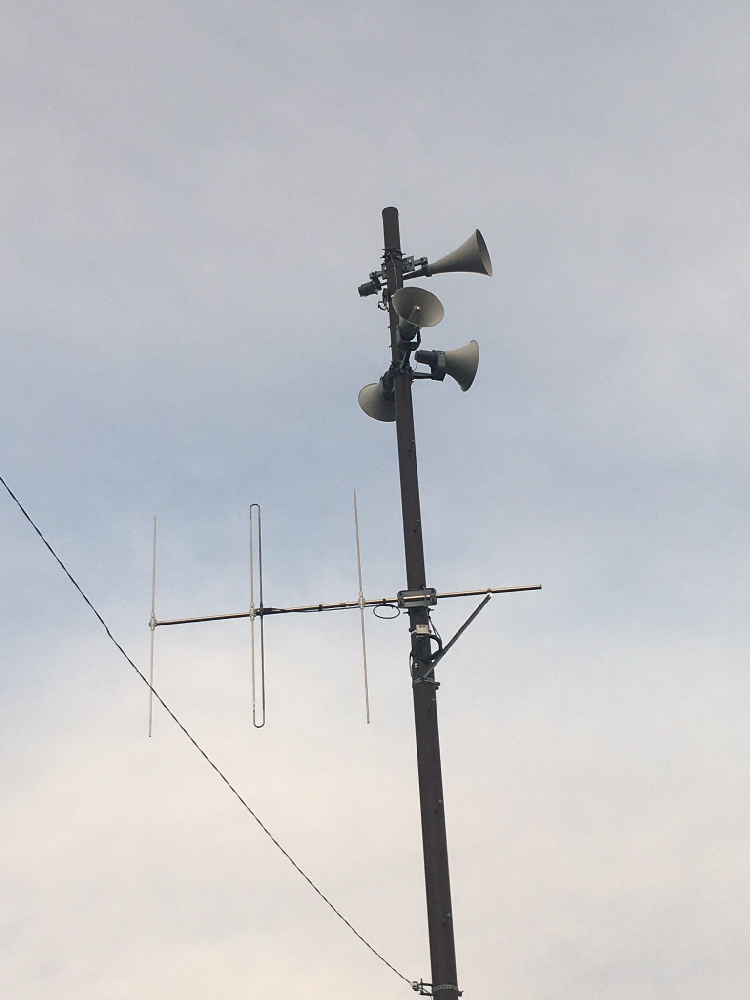
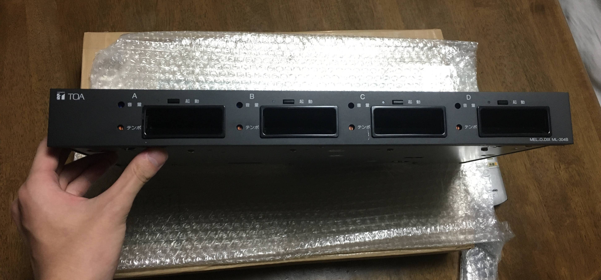
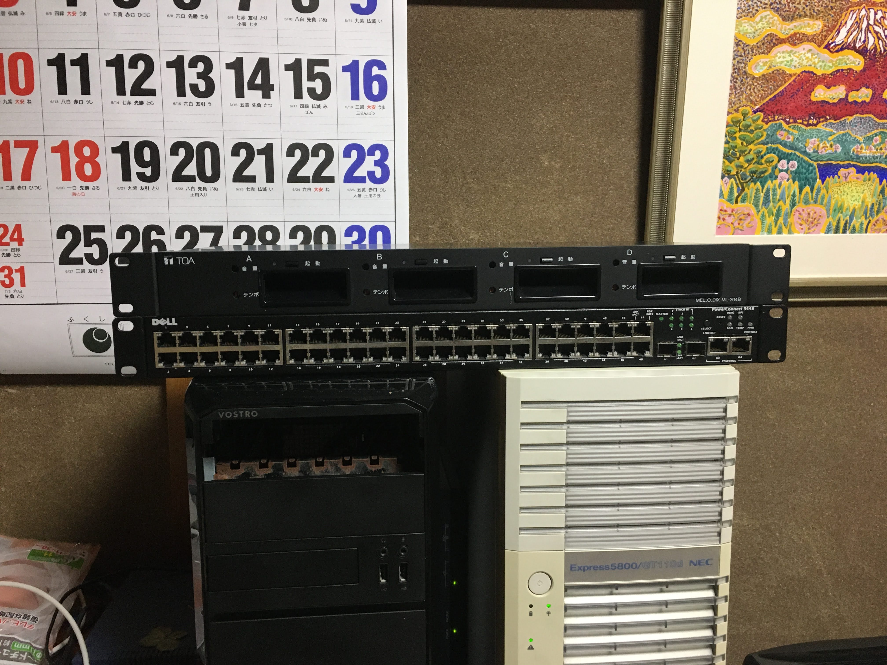
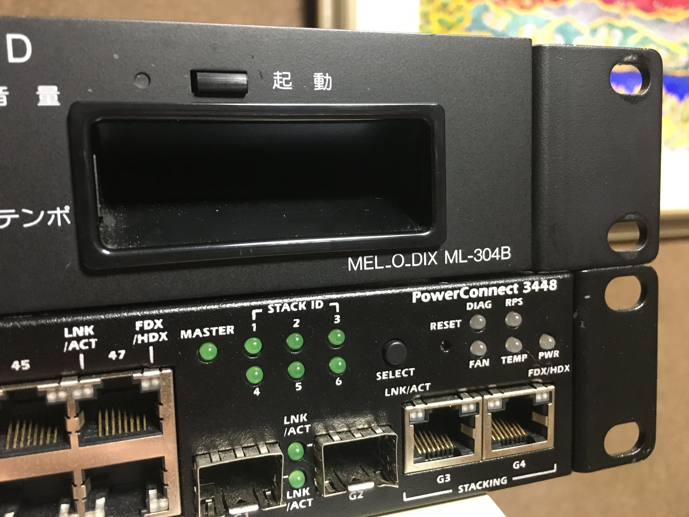

# メロディクスをお迎えしました

<h2>
2022/07/19
</h2>

<!-- 記事ここから -->

夕方の5時とか6時とかになると、行政放送みたいな感じで時報の音楽が流れる地域は多いのではないでしょうか、  
こんな感じのスピーカから↓

この音楽、地域によって色々あって面白いですよね、よくYouTubeとかで調べて聞いてたりします

また、僕の母校の場合PM6:30くらいになると「家路」が流れるんですね。これを合図に部活を終了して片付けを始めたり、駅ダッシュしたりしたもんです

僕自身結構こういう業務用機器に興味があったので調べてみたところ、どうもTOAという会社の機材を使用している様でした。  
具体的には「MEL\_O\_DIX ML-304B」というもので、たまにヤフオクに出てるっぽいので検索条件を保存してしばらく見てたら良さげな出品があったので入札。そして落札  
ちなみに落札したのは7月10日です

届きました🥳

いやあ、ついに手に入れてしまった

ただ、落札したのは本体だけの出品なのでメロディクスカードはおろか電源ケーブルすらありません。電源に関しては要らんほどあるので問題ないですが音源カードがないことには鳴らせないのでそのうち買う予定。今一番欲しいのはMC-T03で、これに家路が収録されてます

　　
　　

そりゃ同じフォームファクタなので当然なんですが、どのご家庭にもある1Uスイッチとほぼ同じ大きさです。19inラックに収まるので周辺機器揃えてオーディオラックみたいなのも作ってみたいですな  
ML-304B、TT-104B、TA2030Rは最低限揃えたいところ、のんびりやっていこうと思います

<!-- 記事ここまで -->

<footer>
©Nch_MOSFET
</footer>

<!-- 画像を入れる時は

-->

<!-- Twitterのツイートを埋め込むときは公式の埋め込みリンクをそのまま貼るだけで良い -->
