# 良い工具で、良い工作を

<h2>
2022/08/13
</h2>

<!-- 記事ここから -->

趣味で電子工作をしていく上で、どうしても工具が必要になってきます

ニッパー、ペンチ、カッター、ハンダゴテ、コテ台、ハンダ吸い取り器、ピンセット、精密ドライバ、、、挙げればキリがありません。場合によってはハンダ除去機（溶かしつつ吸ってくれる便利なやつ）やヒートガン、ワイヤストリッパ、IC引き抜き工具なども必要になってきたり  
工具以外にも必要な機械はたくさんあります。電源装置、電子負荷、オシロスコープ、マルチテスタなどなど。高周波を扱う工作の場合VNA（ベクトルネットワークアナライザ）もあると便利でしょう。僕は高周波を扱う工作をしたことは無いのでこの辺よくわかりませんが

僕自身これらすべてを持っているわけではありませんが、持っているものに関しては何を使っているかを紹介しようと思います。オススメの工具に関してはAmazonリンクを貼っておきますので興味があればどうぞ（アフィリエイトプログラムには参加していません。直リンクです）  
新しい工具が手に入り次第追記していきます

## ペンチ・ニッパー

まずは画像を

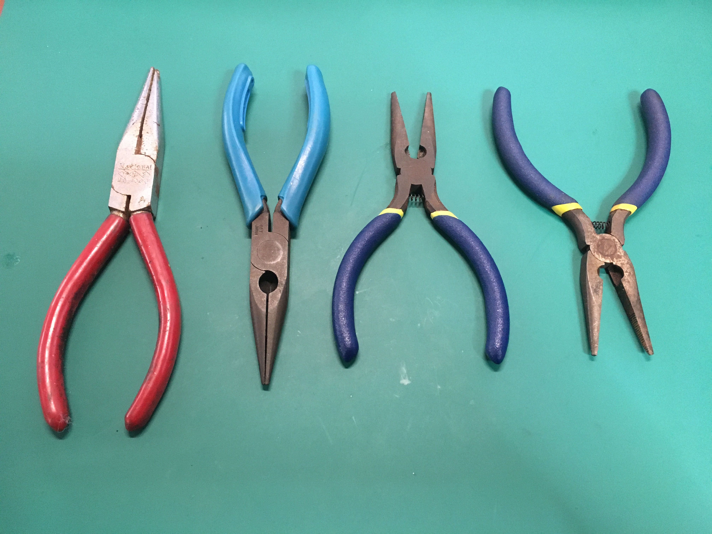
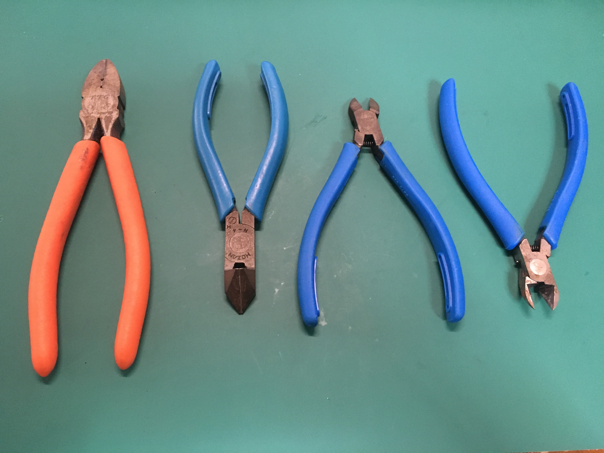

ペンチ、ニッパーともに4つづつ所有しています。が、基本的に使っているのは一部だけです

まずはペンチについて

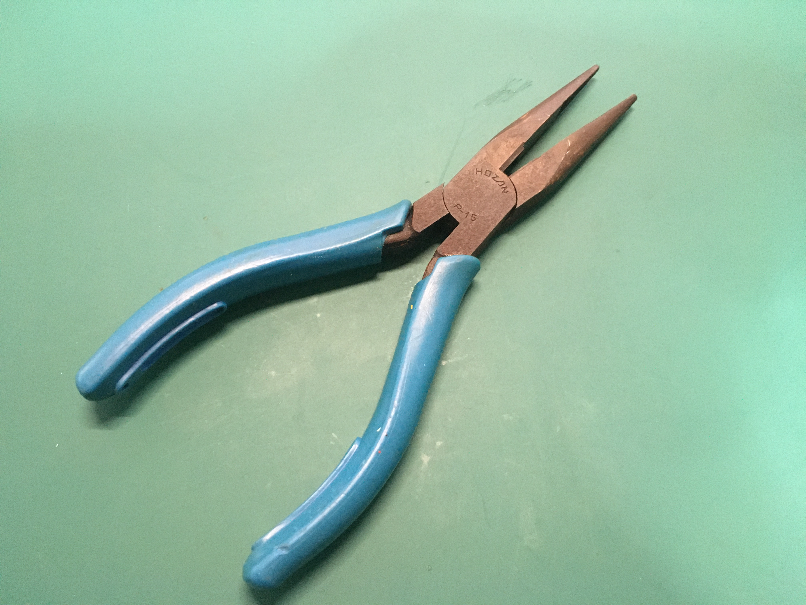

主にHOZAN（ホーザン）の[P-15-125](https://www.amazon.co.jp/dp/B07FQQN434/)を使っています。だいたいのリードベンディングはこれで事足ります  

これは少し短い方ですが、一回り大きいものに[P-15-150](https://www.amazon.co.jp/dp/B07FQTCFKG/)というものもあります

続いてニッパーについて

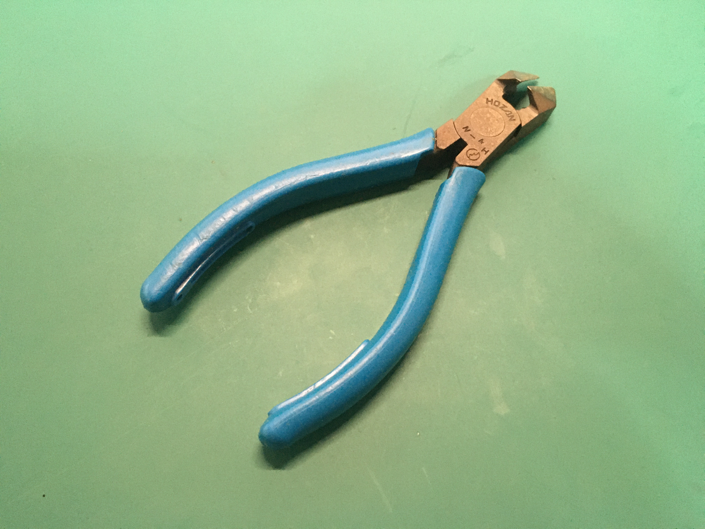

これまたHOZANの[N-4-125](https://www.amazon.co.jp/dp/B0028DH9QK/)を使用しています。配線の切断はもとより、ワイヤストリッパを持っていないのでP-5-125と併用して被覆線を剥いたりと、結構マルチに使用しています

これはツノダの[CN-160](https://www.amazon.co.jp/dp/B000ICAOE2/)で、主にVVFなどの太いケーブルを切るのに使っています。用途はそれくらいかな

基本的にHOZAN製を買っておけば間違いはないです。非常に良い  
ただし用途は間違えないようにしましょうね。2~3種類くらいの大きさを揃えておけばだいたいは事足りると思います

## ピンセット

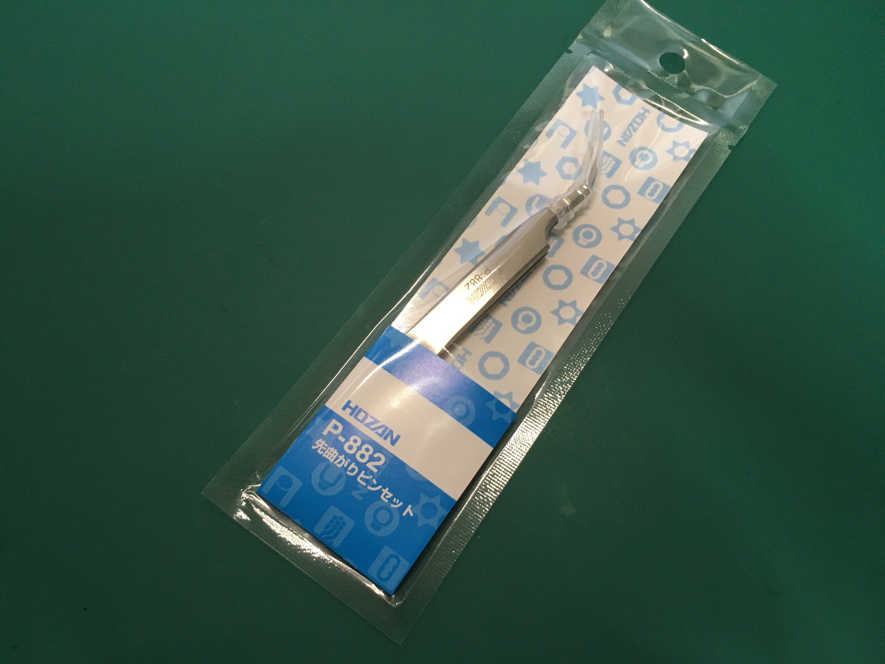

今までずっと100円ショップのものを使っていたので最近買い替えました。HOZAN製[P-882](https://www.amazon.co.jp/dp/B000TGFODS/)です。表面実装部品のはんだ付けをする予定があるので先曲がりの細いものを選びました。あとはストレートタイプの[PP-136](https://www.amazon.co.jp/dp/B07SSRP2NN/)、肉厚ストレートタイプの[PP-103](https://www.amazon.co.jp/dp/B07BS921GZ/)、逆作用タイプの[P-89](https://www.amazon.co.jp/dp/B000TGJTLQ/)をおいおい買い揃えようかなと

## カッター

カッターはOLFA一択でしょうか。僕はすべてOLFAで揃えています

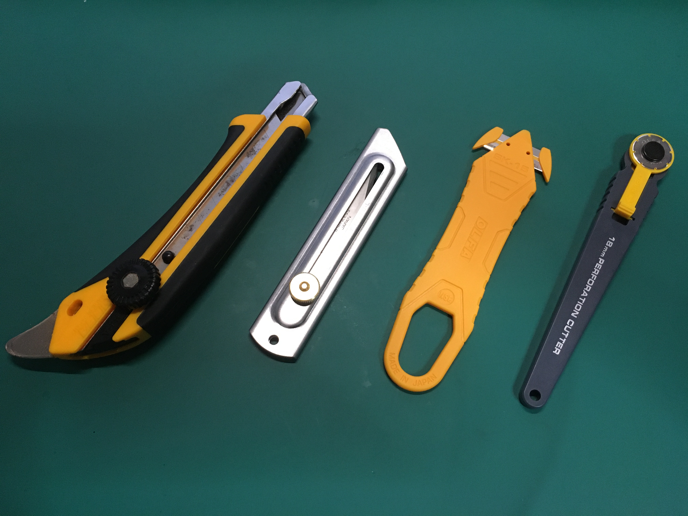

とりあえず何でも切れる[192B](https://www.amazon.co.jp/dp/B001D3ARKG/)、木材も切れる[34B](https://www.amazon.co.jp/dp/B000TGF9DI/)、段ボール箱やレターパックの開梱用の[SK-15](https://www.amazon.co.jp/dp/B07R3V5CCW/)、ミシン目切る用の[ロータリーカッター](https://www.amazon.co.jp/dp/B00L13URXU/)という感じです。バトミングナイフは持ってませんが必要になったら買います

OLFAさん用途別に色々販売してらっしゃるので、用途に合わせた物を選びましょう。ただし、オートロック式はオススメしません。ネジロック式だと無段階調整ができるので良いです

ちなみに番外編として肥後守があります。クラフトナイフ（34B）を買う前まで使ってたものです。結構錆が浮いてきてしまってるので要メンテですが

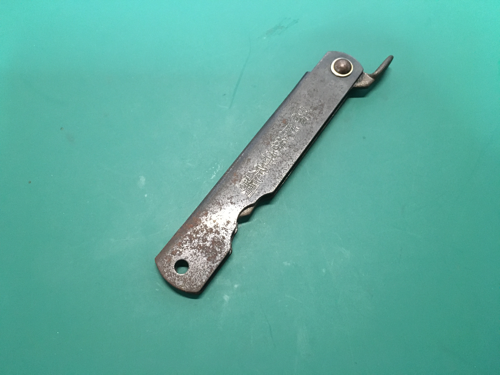
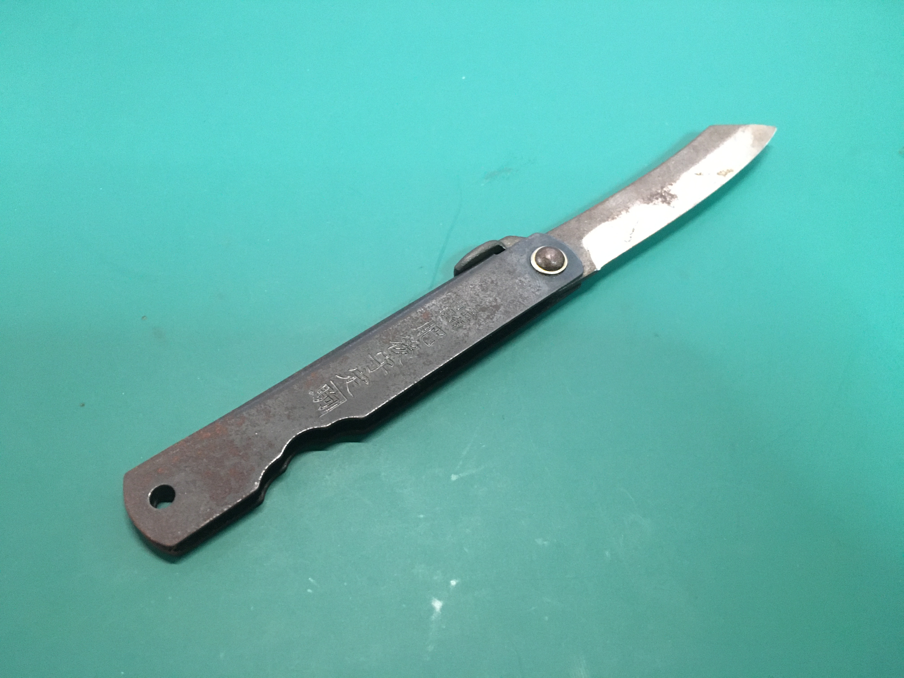

## ハンダシリーズ

<!-- ここに画像を挿入 -->

コテはHakkoの[PRESTO 980](https://www.amazon.co.jp/dp/B009RLDDA2/)を使っています。ブースト効くのが便利で愛用してます  
Hakkoの[FX-600](https://www.amazon.co.jp/dp/B006MQD7M4/)とgootの[PX-280](https://www.amazon.co.jp//dp/B09QJQW1LR/)も使ってみたいので買うかもしれない

コテ台は名称不明のものを使っています。そのうち[Hakko 633](https://www.amazon.co.jp/dp/B000TGNWCS/)にしようと思っています

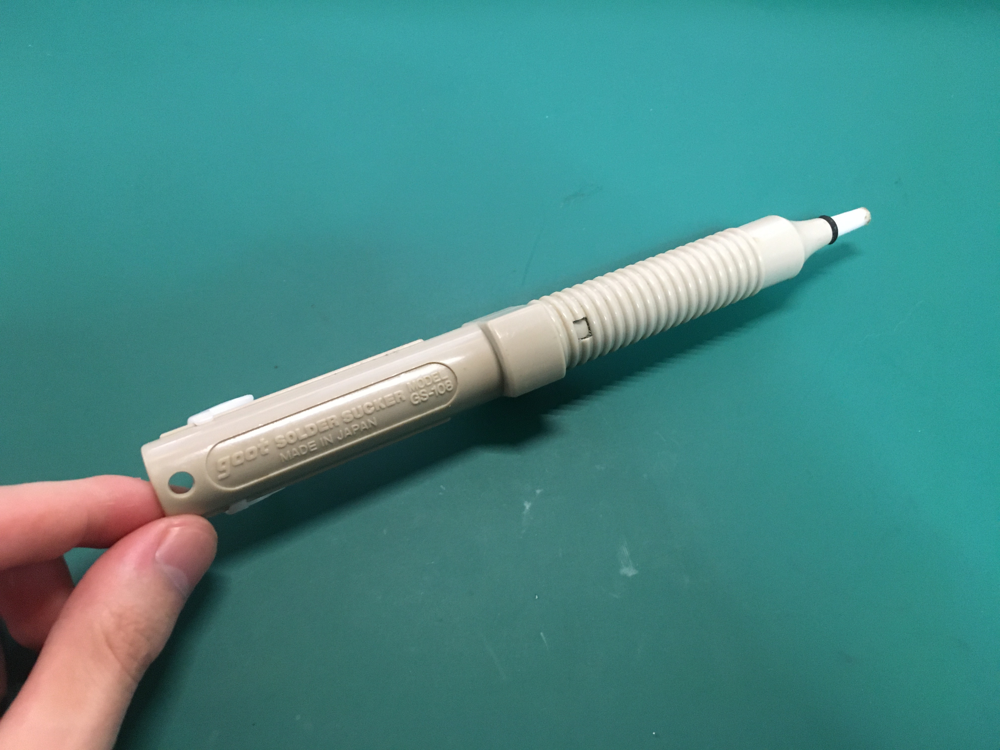

ハンダ吸い取り器はgootの[GS-108](https://www.amazon.co.jp/dp/B0016V5KHU/)を使ってます。可もなく不可もなしという感じで特段の問題はありません

基本的にHakkoとgootから選べば間違い無いでしょう

## ドライバ類

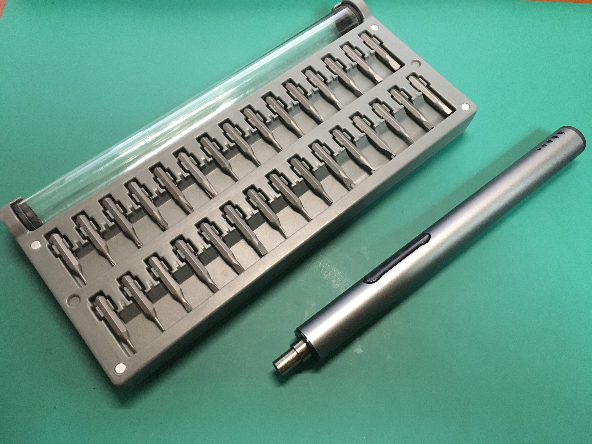

Amazonで買った[精密ドライバセット](https://www.amazon.co.jp/gp/product/B07SW2GHSN/)を使っています。ビットが色々揃ってて使いよい  
実は購入した時初期不良品に当たったんですが、サポートに連絡したところ新品を送ってくださいました。安心して購入できそう

## 測定器類

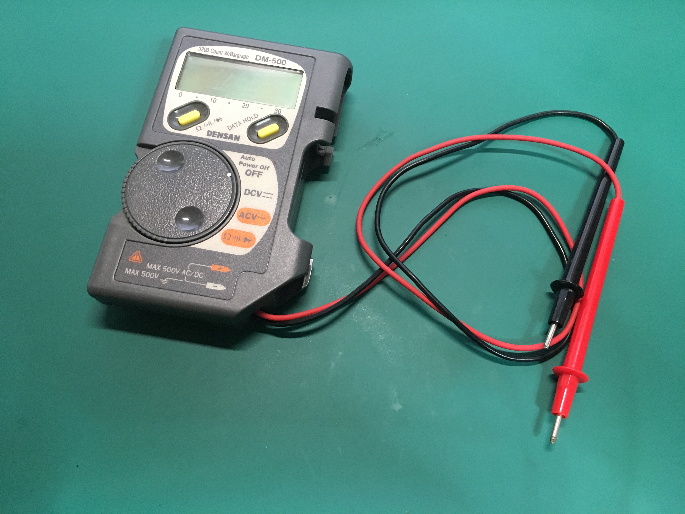

マルチテスタは電子工作を始めた初期にもらったものを使い続けています。これは時が来たら良さげなものに買い替えます（買い替えるものばっかじゃん）

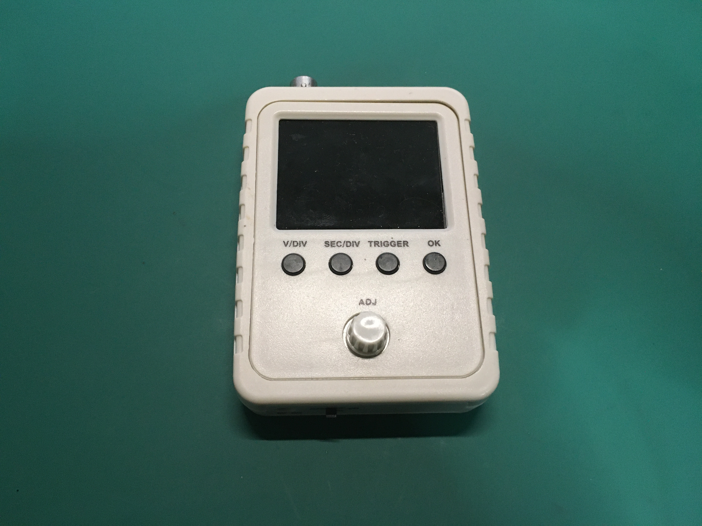

オシロスコープはTwitterのFFさん（[@Raspber_metan](https://twitter.com/Raspber_metan)）に譲って頂いたものを使っています。最低限の機能はあるので初めて買うにはちょうどいいかも  
ただ、同時に複数の波形を観測したいことが多いので4chのオシロスコープを買いたいですね。貯金せねば

[DSO-138](https://www.amazon.co.jp/dp/B07KXPR4RT/)も持ってはいますが使いにくいので使ってません

<!-- 記事ここまで -->

<footer>
©Nch_MOSFET
</footer>

<!-- 画像を入れる時は

-->

<!-- Twitterのツイートを埋め込むときは公式の埋め込みリンクをそのまま貼るだけで良い -->
